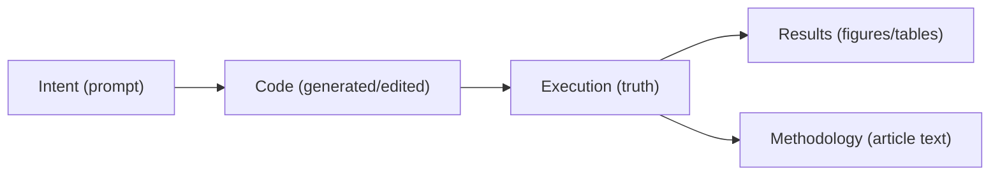
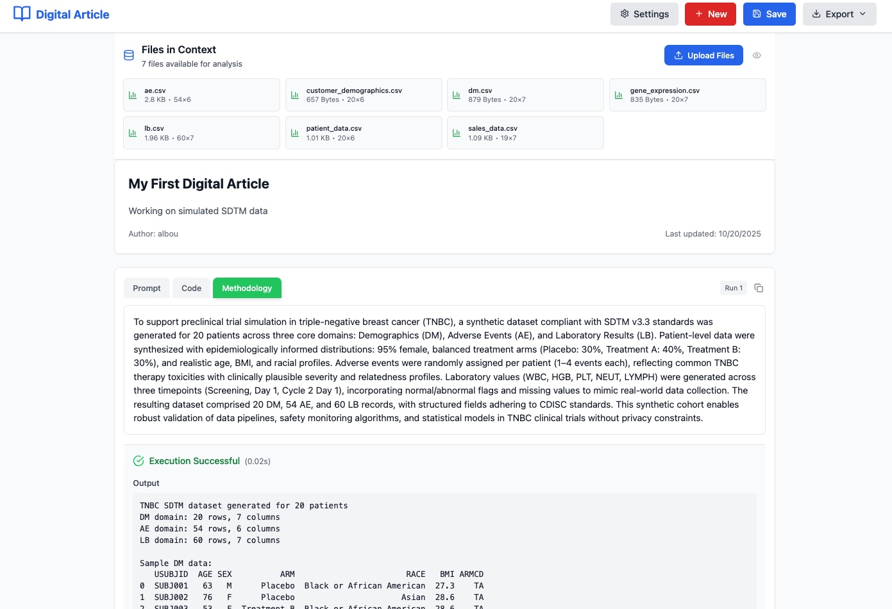

# Digital Article : Your Digital Analytics Assistant

[](https://www.python.org/downloads/)
[](https://reactjs.org/)
[](https://fastapi.tiangolo.com/)

> Article-first analytics notebook: **intent → executable code → verified results → publishable methodology** (with traceability).

## What is Digital Article?

Digital Article is an **article-first** analytics notebook: instead of starting from code, you state what you want to learn in plain language, and Digital Article turns that intent into:

- **executable analysis code** (always inspectable + editable)
- **verified results** (real runtime outputs: figures, tables, logs, errors)
- **publishable narrative** (methodology/results sections, plus optional abstract)

The result is a living report that stays useful after it’s written: it can be re-run, queried, and extended with clear provenance rather than becoming a static snapshot.

### 60-second overview (the core loop)

Digital Article’s key idea is the “article-first execution loop”:

**intent → executable code → verified results → publishable methodology** (with traceability).



**Proof artifact**: see the example scientific PDF export in [`examples/article/Digital_Article_Export_Example.pdf`](examples/article/Digital_Article_Export_Example.pdf) (Kaplan–Meier, Cox model, diagnostics).



### Traditional Notebook
```
[Code: Data loading, cleaning, analysis]
[Output: Plots and tables]
```

### Digital Article
```
[Prompt: "Analyze gene expression distribution across experimental conditions"]
[Generated Methodology: "To assess gene expression patterns, data from 6 samples..."]
[Results: Plots and tables]
[Code: Available for inspection and editing]
```

## Key Features

- **Natural Language Analysis**: Write prompts like "create a heatmap of gene correlations" instead of Python code
- **Intelligent Code Generation**: LLM-powered code generation using AbstractCore (supports LMStudio, Ollama, OpenAI, and more)
- **Auto-Retry Error Fixing**: System automatically debugs and fixes generated code (up to 5 attempts)
- **Scientific Methodology Generation**: Automatically creates article-style explanations of your analysis
- **Rich Output Capture**: Matplotlib plots, Plotly interactive charts, Pandas tables, and text output
- **Publication-Ready PDF Export**: Generate scientific article PDFs with methodology, results, and optional code
- **Transparent Code Access**: View, edit, and understand all generated code
- **Persistent Execution Context**: Variables persist across cells, and can be restored after backend restarts
- **Workspace Isolation**: Each notebook has its own data workspace
- **AI Review (Optional)**: Generate a peer-review style critique of your article with trace capture and SSE streaming

## What makes it trustworthy (and what it does not)

Digital Article treats **execution as the source of truth**: the model proposes code, but results come from real runtime outputs.

To support review and audit, Digital Article keeps key artifacts inspectable:
- **Code + diffs**: generated code (and any edits / safe rewrites)
- **Results + errors**: plots, tables, stdout/stderr, and tracebacks
- **Deterministic guardrails**: lint reports and “safe auto-fix” reports (offline, before spending LLM budget)
- **LLM traces (where supported)**: prompts, responses, and timing metadata

It does **not** guarantee scientific correctness: always review the code, outputs, and methodology (the optional “critical reviewer” can help surface methodological issues).

## Who Is This For?

- **Domain Experts** (biologists, clinicians, social scientists): Perform sophisticated analyses without programming expertise
- **Data Scientists**: Accelerate exploratory analysis and documentation
- **Researchers**: Create reproducible analyses with built-in methodology text
- **Educators**: Teach data analysis concepts without syntax barriers
- **Anyone** who wants to think in terms of *what* to analyze rather than *how* to code it

## Quick Start

### Prerequisites

- Python 3.11+
- Node.js 18+
- LMStudio or Ollama (for local LLM) OR OpenAI API key

### Installation

```bash
# Clone repository
git clone https://github.com/lpalbou/digitalarticle.git
cd digitalarticle

# Set up Python environment
python -m venv .venv
source .venv/bin/activate  # On macOS/Linux
pip install -e .  # Installs from pyproject.toml

# Set up frontend
cd frontend
npm install
cd ..
```

### Start the Application (Local)

To run the application locally (e.g., on your Mac/PC):

```bash
# Terminal 1: Backend
da-backend

# Terminal 2: Frontend
da-frontend
```

Then open [http://localhost:3000](http://localhost:3000)

#### Configuration (`config.json`)
When running locally, the `config.json` at the root should use relative paths:
```json
{
  "llm": { "provider": "ollama", "model": "gemma3n:e2b" },
  "paths": {
    "notebooks_dir": "data/notebooks",
    "workspace_dir": "data/workspace"
  }
}
```

**Full setup guide**: See [Getting Started](docs/getting-started.md)

## Example output (PDF)

- [`examples/article/Digital_Article_Export_Example.pdf`](examples/article/Digital_Article_Export_Example.pdf) — end-to-end survival analysis demo (Kaplan–Meier curves, Cox model, and diagnostics) exported as a publication-style PDF.
- More example content: [`examples/README.md`](examples/README.md)

<details>
<summary>Docker deployment (optional)</summary>

### Docker Deployment

We provide **2-Tiers** (default: frontend+backend, external LLM), **Monolithic** (single container, optional bundled Ollama), and **3-Tier** (docker-compose: frontend+backend+ollama) deployment options.

#### Option A: 2-Tiers (Default / Recommended)
Best for most deployments: one container for frontend+backend that connects to an **external** LLM server (LMStudio/Ollama/vLLM/OpenAI-compatible) via environment variables.

1. **Copy the appropriate Dockerfile to root:**
   ```bash
   cp docker/2-tiers/Dockerfile Dockerfile
   ```

2. **Build and Run:**
   ```bash
   docker build -t digital-article .
   docker run -p 80:80 -v ./data:/app/data digital-article
   ```

#### Option B: Monolithic (Bundled Ollama)
Best for self-contained deployments (or NVIDIA GPU servers via `Dockerfile.nvidia`).

```bash
cp docker/monolithic/Dockerfile Dockerfile
docker build -t digital-article .
docker run -p 80:80 -v ./data:/app/data digital-article
```

#### ⚡ Performance on Apple Silicon (M1/M2/M3)

Docker on macOS runs in a Linux VM and **cannot access the Neural Engine or GPU directly** due to architectural limitations of the Apple Virtualization Framework. This causes the built-in Ollama to run on CPU emulation, which is significantly slower (e.g., 34s vs 7s for generation).

**To get native performance (7s) with Docker:**
1. Run Ollama natively on your Mac (installs globally):
   ```bash
   ollama serve
   ```
2. Run the **Standard CPU** container but point it to your host's Ollama:
   ```bash
   # 1. Copy the generic CPU Dockerfile
   cp docker/monolithic/Dockerfile Dockerfile
   
   # 2. Build
   docker build -t digital-article .
   
   # 3. Run with host.docker.internal
   docker run -p 80:80 \
     -v ./data:/app/data \
     -e OLLAMA_BASE_URL=http://host.docker.internal:11434 \
     digital-article
   ```
   *Note: This "Hybrid Approach" gives you container isolation for the app while leveraging your Mac's full hardware acceleration for AI.*

#### Option B: 3-Tier (Docker Compose)
Best for development and production flexibility.

```bash
docker compose up -d
```

**Note on Docker Paths:**
When running in Docker, the container uses environment variables to override paths, so they point to absolute paths inside the container (e.g., `/app/data/notebooks`). You do not need to change `config.json` manually for Docker; the image handles it.

**Full Docker guide**: See [docker/README.md](docker/README.md)

</details>

<details>
<summary>LLM configuration (how config is stored, precedence, remote access)</summary>

## LLM Configuration

Digital Article requires an LLM provider to generate code from prompts. Configuration is intentionally flexible (local servers, cloud APIs, Docker).

### What actually stores the configuration (code-as-truth)
- **Project config (global)**: `config.json` (updated by `POST /api/llm/providers/select` in `backend/app/api/llm.py`)
- **Per-user settings (local persistence)**: stored under `{WORKSPACE_DIR}/user_settings/{username}.json` (served by `GET/PUT /api/settings` in `backend/app/api/settings.py`)
- **Per-notebook fields (metadata)**: `Notebook.llm_provider` / `Notebook.llm_model` in `backend/app/models/notebook.py` (used by `NotebookService.execute_cell()` to re-create the `LLMService` when needed)

### Per-Notebook Configuration
- Each notebook stores its own provider/model fields.
- During code generation, `backend/app/services/notebook_service.py::NotebookService.execute_cell()` will re-initialize `LLMService` if the notebook config differs from the currently loaded one.
- Note: Today this still runs in a **single backend process** with shared services (single-user / small-team assumptions).

### Visual Feedback
- The **status footer** at the bottom shows the current provider, model, and context size
- Real-time updates when configuration changes
- Click the footer's **Settings** button for quick access to configuration

### Remote Access
All configuration works seamlessly when accessing Digital Article from remote machines (e.g., `http://server-ip:3000`). The settings modal and status footer use relative API paths for proper remote connectivity.

</details>

## Example Usage

### Simple Analysis

**Prompt:**
```
Load the uploaded CSV file and show the distribution of values in the main measurement column
```

**Generated Code:**
```python
# Example only — actual generated code depends on your uploaded file
```

**Generated Methodology:**
```
To assess the overall distribution of gene expression levels, the dataset
containing 20 genes across 6 experimental conditions was examined. The
analysis revealed a mean expression level of 15.3 ± 4.2 across all genes,
with a right-skewed distribution indicative of heterogeneous expression
patterns.
```

### Progressive Analysis

```
Cell 1: "Load patient_data.csv and show basic statistics"
Cell 2: "Create a scatter plot of age vs blood_pressure colored by gender"
Cell 3: "Perform t-test comparing blood pressure between genders"
Cell 4: "Generate a summary table with mean values by gender"
```

Each cell builds on the previous context, with variables persisting across cells.

## Architecture Overview

```
Frontend (React + TypeScript)
    ↓ HTTP/REST
Backend (FastAPI)
    ↓
Services Layer
    ├─ LLMService (AbstractCore → LMStudio/Ollama/OpenAI)
    ├─ ExecutionService (Python code execution sandbox)
    ├─ NotebookService (orchestration)
    └─ PDFService (scientific article generation)
    ↓
Data Layer
    ├─ Notebooks (JSON files)
    └─ Workspaces (isolated data directories)
```

**Detailed architecture**: See [Architecture Documentation](docs/architecture.md)

## Technology Stack

### Backend
- **FastAPI** - Modern Python web framework
- **AbstractCore** - LLM provider abstraction
- **Pandas, NumPy, Matplotlib, Plotly** - Data analysis and visualization
- **Pydantic** - Data validation and serialization
- **ReportLab/WeasyPrint** - PDF generation

### Frontend
- **React 18 + TypeScript** - UI framework with type safety
- **Vite** - Lightning-fast dev server and build tool (runs on port 3000)
- **Tailwind CSS** - Utility-first styling
- **Monaco Editor** - Code viewing
- **Plotly.js** - Interactive visualizations
- **Axios** - HTTP client

## Project Philosophy

Digital Article is built on the belief that **analytical tools should adapt to how scientists think, not the other way around**. Key principles:

1. **Article-First**: The narrative is primary; code is a derived implementation
2. **Transparent Generation**: All code is inspectable and editable
3. **Scientific Rigor**: Auto-generate methodology text suitable for publications
4. **Progressive Disclosure**: Show complexity only when needed
5. **Intelligent Recovery**: Auto-fix errors before asking for user intervention

**Full philosophy**: See [Philosophy Documentation](docs/philosophy.md)

## Documentation

- **Start here**: [Getting Started](docs/getting-started.md)
- **One-pager (why it exists + core loop)**: [Digital Article one-pager](docs/presentation/README.md)
- **Canonical map**: [Architecture](docs/architecture.md)
- **Common fixes**: [Troubleshooting](docs/troubleshooting.md)
- **Docs index**: [Documentation overview](docs/overview.md)
- **Limitations / production readiness**: [Limitations](docs/limitations.md)
- **Core systems**:
  - [Error handling](docs/error-handling.md)
  - [Export](docs/export.md)
  - [Docker containerization](docs/docker-containerization.md)
  - [Variable/state persistence](docs/variable-state-persistence.md)
  - [Personas + Review](docs/persona-and-review-architecture.md)
- **Dive-ins (critical components)**: see [`docs/dive_ins/`](docs/dive_ins/)
- **Diagrams**: [Data flow](docs/data_flow.md)
- **Accumulated insights**: [Knowledge base](docs/knowledge_base.md)
- **Project**:
  - [Philosophy](docs/philosophy.md)
- [Backlog (canonical planning)](docs/backlog/README.md) - Planned features and development timeline

## Current Status

**Version**: 0.3.2 (Beta)

**Working Features**:
- ✅ Natural language to code generation
- ✅ Code execution with rich output capture
- ✅ Auto-retry error correction (up to 5 attempts)
- ✅ Scientific methodology generation
- ✅ Matplotlib and Plotly visualization support
- ✅ Pandas DataFrame capture and display
- ✅ Export: scientific PDF + clean JSON (HTML/Markdown exports are early-stage placeholders; see `docs/export.md`)
- ✅ File upload and workspace management
- ✅ Persistent execution context across cells
- ✅ Article review (SSE streaming + trace capture)

**Limitations / Production Readiness**: See [docs/limitations.md](docs/limitations.md).

## Example Use Cases

### Bioinformatics
```
"Load RNA-seq counts and perform differential expression analysis between treatment and control"
"Create a volcano plot highlighting significantly differentially expressed genes"
"Generate a heatmap of top 50 DE genes with hierarchical clustering"
```

### Clinical Research
```
"Analyze patient outcomes by treatment group with survival curves"
"Test for significant differences in biomarkers across cohorts"
"Create a forest plot of hazard ratios for different risk factors"
```

### Data Exploration
```
"Load the dataset and identify missing values and outliers"
"Perform PCA and visualize the first two principal components"
"Fit a linear model predicting outcome from predictors and show coefficients"
```

## Comparison to Alternatives

| Feature | Digital Article | Jupyter | ChatGPT Code Interpreter | Observable |
|---------|----------------|---------|--------------------------|------------|
| Natural language prompts | ✅ Primary | ❌ | ✅ | ❌ |
| Code transparency | ✅ Always visible | ✅ | ⚠️ Limited | ⚠️ Limited |
| Local LLM support | ✅ | ❌ | ❌ | ❌ |
| Auto-error correction | ✅ 5 retries | ❌ | ⚠️ Manual | ❌ |
| Scientific methodology | ✅ Auto-generated | ❌ | ❌ | ❌ |
| Publication PDF export | ✅ | ⚠️ Via nbconvert | ❌ | ❌ |
| Persistent context | ✅ | ✅ | ⚠️ Session-based | ✅ |
| Self-hosted | ✅ | ✅ | ❌ | ❌ |

## Project planning (canonical)

- **Backlog (canonical planning)**: [`docs/backlog/README.md`](docs/backlog/README.md)
- **Legacy roadmap archive**: [`docs/backlog/completed/0032_legacy_roadmap.md`](docs/backlog/completed/0032_legacy_roadmap.md)

## Contributing

We welcome contributions! Areas where help is needed:

- **Testing**: Try the system with your data and report issues
- **Documentation**: Improve guides, add examples
- **LLM Prompts**: Enhance code generation quality
- **UI/UX**: Improve the interface
- **Domain Templates**: Add analysis workflows for specific fields

See [CONTRIBUTING.md](CONTRIBUTING.md) for development guidelines.

## License

MIT License - see [`LICENSE`](LICENSE) file for details.

## Citation

If you use Digital Article in your research, please cite:

```bibtex
@software{digital_article_2025,
  title = {Digital Article: Natural Language Computational Notebooks},
  author = {Laurent-Philippe Albou},
  year = {2025},
  url = {https://github.com/lpalbou/digitalarticle}
}
```

## Acknowledgments

- **AbstractCore** for LLM provider abstraction
- **LMStudio** and **Ollama** for local LLM serving
- **FastAPI** and **React** communities for excellent frameworks
- Inspired by literate programming (Knuth), computational essays (Wolfram), and Jupyter notebooks

## Support and Contact

- **Issues**: [GitHub Issues](https://github.com/lpalbou/digitalarticle/issues)
- **Discussions**: [GitHub Discussions](https://github.com/lpalbou/digitalarticle/discussions)
- **Email**: lpalbou@gmail.com

---

**We're not building a better notebook. We're building a different kind of thinking tool—one that speaks the language of science, not just the language of code.**
