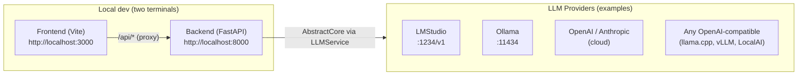
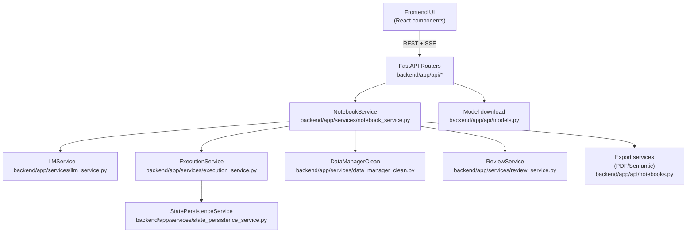

# Architecture Documentation

> **Status (2026-01-31):** This page starts with the **current canonical architecture map** grounded in the codebase. Everything under **“Legacy (historical)”** is older material kept for context and may drift.

## Current architecture (canonical)

### Primary entry points

- **Backend API**: FastAPI app in [`backend/app/main.py`](../backend/app/main.py) (health: `/health`, root: `/`)
- **Frontend dev**: Vite dev server in [`frontend/`](../frontend) (proxy `/api/*` → backend)
- **Local CLI**:
  - `da-backend` → [`digitalarticle/backend.py`](../digitalarticle/backend.py)
  - `da-frontend` → [`digitalarticle/frontend.py`](../digitalarticle/frontend.py)
- **Docker deployments**: [`docker/README.md`](../docker/README.md) (2-tiers default, monolithic, 3-tiers)

### API surface (routers)

The backend is organized as routers mounted in [`backend/app/main.py`](../backend/app/main.py):

- `/api/cells/*` → [`backend/app/api/cells.py`](../backend/app/api/cells.py) (+ [`backend/app/api/ai_code_fix.py`](../backend/app/api/ai_code_fix.py) mounted under the same prefix)
- `/api/notebooks/*` → [`backend/app/api/notebooks.py`](../backend/app/api/notebooks.py)
- `/api/llm/*` → [`backend/app/api/llm.py`](../backend/app/api/llm.py)
- `/api/files/*` → [`backend/app/api/files.py`](../backend/app/api/files.py)
- `/api/system/*` → [`backend/app/api/system.py`](../backend/app/api/system.py)
- `/api/settings*` → [`backend/app/api/settings.py`](../backend/app/api/settings.py)
- `/api/models*` → [`backend/app/api/models.py`](../backend/app/api/models.py)
- `/api/personas/*` → [`backend/app/api/personas.py`](../backend/app/api/personas.py)
- `/api/review/*` → [`backend/app/api/review.py`](../backend/app/api/review.py)
- `/api/chat/*` → [`backend/app/api/chat.py`](../backend/app/api/chat.py)

### Deployment map



### Runtime call graph (high-level)



### Persistence map (what gets stored where)

- **Notebooks (JSON)**:
  - Path resolution: [`backend/app/config.py::Config.get_notebooks_dir()`](../backend/app/config.py) (ENV `NOTEBOOKS_DIR` > [`config.json`](../config.json) > default)
  - Storage format: [`backend/app/models/notebook.py::Notebook`](../backend/app/models/notebook.py)
  - Persistence implementation: [`backend/app/services/notebook_service.py`](../backend/app/services/notebook_service.py) (atomic write pattern in `_save_notebook()`)
- **Workspace files (uploads, previews, user settings)**:
  - Root: [`backend/app/config.py::Config.get_workspace_root()`](../backend/app/config.py) (ENV `WORKSPACE_DIR` > [`config.json`](../config.json) > default)
  - Per-notebook files: [`backend/app/services/data_manager_clean.py`](../backend/app/services/data_manager_clean.py)
  - Per-user settings: [`backend/app/services/user_settings_service.py`](../backend/app/services/user_settings_service.py) (`{workspace_root}/user_settings/{username}.json`)
- **Execution state snapshots (pickle)**:
  - Current default root: [`backend/notebook_workspace/`](../backend/notebook_workspace) (see [`backend/app/services/state_persistence_service.py::StatePersistenceService`](../backend/app/services/state_persistence_service.py))
  - Triggered by: [`backend/app/services/execution_service.py`](../backend/app/services/execution_service.py)
- **Observability traces (JSONL)** — ADR 0005:
  - Root: `{workspace_root}/traces/`
  - Schema: [`backend/app/models/trace.py::TraceEvent`](../backend/app/models/trace.py) (flow → task → step hierarchy)
  - Store: [`backend/app/services/trace_store.py::TraceStore`](../backend/app/services/trace_store.py) (append-only JSONL, auto-rotation)
  - API: [`backend/app/api/traces.py`](../backend/app/api/traces.py) (`/api/traces/*`)
  - Features: secret redaction, truncation with notice, retention cleanup

### Critical "dive-in" docs (start here after the map)

- [`docs/dive_ins/notebook_service.md`](dive_ins/notebook_service.md) — orchestration + execution loop + auto-retry
- [`docs/dive_ins/llm_service.md`](dive_ins/llm_service.md) — AbstractCore integration, tracing, token tracking, config surfaces
- [`docs/dive_ins/execution_service.md`](dive_ins/execution_service.md) — execution sandbox, rich output capture, state saving
- [`docs/dive_ins/data_manager.md`](dive_ins/data_manager.md) — file workspace, previews, LLM file context
- [`docs/dive_ins/review_service.md`](dive_ins/review_service.md) — reviewer persona templates + streaming article review
- [`docs/dive_ins/persona_system.md`](dive_ins/persona_system.md) — persona models + combination + notebook metadata

## Legacy (historical)

## Overview

Digital Article is a full-stack web application that transforms conventional computational notebooks into "article-first" documents. Unlike traditional notebooks (e.g., Jupyter) where cells primarily contain code with accompanying outputs, Digital Article inverts this paradigm: users interact via natural language prompts that are transformed into executable code, with the option to view generated code or scientific methodology explanations.

## System Architecture

```
┌─────────────────────────────────────────────────────────────┐
│                         Frontend                             │
│                    (React + TypeScript)                      │
│                                                              │
│  ┌──────────────┐  ┌──────────────┐  ┌──────────────┐      │
│  │   Notebook   │  │     Cell     │  │     File     │      │
│  │  Container   │  │  Component   │  │   Context    │      │
│  └──────┬───────┘  └──────┬───────┘  └──────┬───────┘      │
│         │                  │                  │              │
│         └──────────────────┴──────────────────┘              │
│                             │                                │
│                      ┌──────▼──────┐                        │
│                      │   API Client │                        │
│                      │  (Axios)     │                        │
│                      └──────┬──────┘                        │
└─────────────────────────────┼────────────────────────────────┘
                              │ HTTP/REST
                              │
┌─────────────────────────────▼────────────────────────────────┐
│                         Backend                              │
│                      (FastAPI + Python)                      │
│                                                              │
│  ┌──────────────────────────────────────────────────────┐   │
│  │                    API Layer                         │   │
│  │  ┌─────────┐ ┌─────────┐ ┌─────┐ ┌──────┐ ┌──────┐│   │
│  │  │Notebooks│ │  Cells  │ │ LLM │ │Files │ │System││   │
│  │  └────┬────┘ └────┬────┘ └──┬──┘ └──┬───┘ └──┬───┘│   │
│  └───────┼───────────┼──────────┼───────┼────────┼─────┘   │
│          │           │          │       │        │          │
│  ┌───────▼───────────▼──────────▼───────▼────────▼─────┐   │
│  │                 Service Layer                        │   │
│  │  ┌──────────┐ ┌──────────┐ ┌──────────┐            │   │
│  │  │ Notebook │ │   LLM    │ │Execution │            │   │
│  │  │ Service  │ │ Service  │ │ Service  │            │   │
│  │  └────┬─────┘ └────┬─────┘ └────┬─────┘            │   │
│  │       │            │            │                   │   │
│  │  ┌────▼────────────▼────────────▼─────┐            │   │
│  │  │       Data Manager (Clean)         │            │   │
│  │  └────────────────────────────────────┘            │   │
│  └────────────────────────────────────────────────────┘   │
│                                                            │
│  ┌────────────────────────────────────────────────────┐   │
│  │              External Integrations                 │   │
│  │  ┌─────────────────┐      ┌──────────────────┐   │   │
│  │  │  AbstractCore   │      │  Python Runtime  │   │   │
│  │  │  (LLM Provider) │      │  (exec sandbox)  │   │   │
│  │  └─────────────────┘      └──────────────────┘   │   │
│  └────────────────────────────────────────────────────┘   │
└──────────────────────────────────────────────────────────┘
```

## Component Breakdown

### Frontend Architecture

#### Technology Stack
- **React 18.2** - UI framework
- **TypeScript** - Type safety
- **Vite 4.5** - Modern build tool and dev server
  - Extremely fast hot module replacement (HMR)
  - Native ES modules support (no bundling in dev)
  - Optimized production builds with Rollup
  - Configured for port 3000 (see [`frontend/vite.config.ts`](../frontend/vite.config.ts))
  - API proxy: `/api/*` → `http://localhost:8000/api/*`
- **Tailwind CSS** - Styling
- **React Router** - Navigation
- **Axios** - HTTP client
- **Monaco Editor** - Code display (via @monaco-editor/react)
- **Plotly.js** - Interactive visualizations
- **Marked** - Markdown rendering

#### Key Components

##### NotebookContainer ([`frontend/src/components/NotebookContainer.tsx`](../frontend/src/components/NotebookContainer.tsx))
**Responsibility**: Root orchestration component managing notebook lifecycle

**Core State**:
- Notebook data (cells, metadata)
- Execution state tracking
- Auto-save management
- PDF generation coordination

**Key Functions**:
- `loadNotebook()` - Fetch notebook by ID
- `createNewNotebook()` - Initialize new digital article
- `executeCell()` - Coordinate cell execution with backend
- `exportNotebookPDF()` - Generate scientific PDF export
- `updateCell()` - Optimistic UI updates with backend sync

**Design Pattern**: Centralized state management with useCallback memoization for performance

##### NotebookCell ([`frontend/src/components/NotebookCell.tsx`](../frontend/src/components/NotebookCell.tsx))
**Responsibility**: Individual cell rendering and interaction

**Features**:
- Multi-mode display (Prompt/Code/Methodology/Results)
- Real-time execution status
- Auto-retry visualization
- Rich output rendering (plots, tables, errors)
- Inline editing with immediate feedback

**Output Types Supported**:
- Text (stdout/stderr)
- Matplotlib plots (base64 PNG)
- Plotly interactive plots (JSON)
- Pandas DataFrames (HTML tables)
- Python errors with full tracebacks

##### FileContextPanel ([`frontend/src/components/FileContextPanel.tsx`](../frontend/src/components/FileContextPanel.tsx))
**Responsibility**: Display available data files for the notebook

**Features**:
- File listing from data manager
- File metadata display (size, type, modification date)
- Data preview (for CSV/tabular data)
- File upload/delete functionality
- Refresh trigger on execution

##### Header ([`frontend/src/components/Header.tsx`](../frontend/src/components/Header.tsx))
**Responsibility**: Global actions and navigation

**Actions**:
- Create new notebook
- Save current notebook
- Export (JSON, HTML, Markdown, PDF)
- PDF generation with progress indication

##### PDFGenerationModal (`frontend/src/components/PDFGenerationModal.tsx`)
**Responsibility**: Visual feedback during scientific PDF generation

**Stages**:
1. Analyzing notebook structure
2. Generating scientific content (LLM-based methodology)
3. Creating PDF document
4. Complete

##### LLMStatusFooter ([`frontend/src/components/LLMStatusFooter.tsx`](../frontend/src/components/LLMStatusFooter.tsx))
**Responsibility**: Real-time visual feedback of current LLM configuration

**Features**:
- Fixed position footer at bottom of screen
- Displays provider, model, and context window information from AbstractCore
- Real-time status updates (Connected, Error, Loading)
- Token configuration display (max_tokens, max_output_tokens)
- Formatted token sizes (e.g., "32k", "8M")
- Click to open LLMSettingsModal
- Auto-refresh every 30 seconds
- Works seamlessly with remote access (uses relative API paths)

**Data Flow**:
- Fetches status from `GET /api/llm/status` on mount
- Polls endpoint every 30 seconds for updates
- Displays connection errors gracefully
- Updates immediately when global config changes

**Integration**:
- Rendered in NotebookContainer
- Bottom padding added to main content to prevent overlap
- Settings button callback opens LLMSettingsModal

##### ModelDownloadContext ([`frontend/src/contexts/ModelDownloadContext.tsx`](../frontend/src/contexts/ModelDownloadContext.tsx))
**Responsibility**: Global state management for async model downloads

**Features**:
- Non-blocking SSE-based download streaming
- Real-time progress tracking (status, percent, bytes)
- Persistent state at App level (survives modal close/reopen)
- Toast notifications on completion/error
- Download cancellation via AbortController

**State**:
```typescript
{
  status: 'idle' | 'starting' | 'downloading' | 'verifying' | 'complete' | 'error'
  progress: number  // 0-100
  currentSize?: string
  totalSize?: string
  message?: string
  model?: string
  provider?: string
}
```

**API Integration**:
- Connects to `POST /api/models/pull` (SSE stream)
- Streams progress updates in real-time
- Used by SettingsModal for Ollama, HuggingFace, and MLX downloads

**Why App-level context**: Ensures download state persists when settings modal closes, enabling true background downloads

#### API Client ([`frontend/src/services/api.ts`](../frontend/src/services/api.ts))

**Design**: Modular API client with separated concerns

**Modules**:
- `notebookAPI` - CRUD operations for notebooks
- `cellAPI` - Cell management and execution
- `llmAPI` - Direct LLM interactions (code generation, configuration, status)
  - **New methods**: `getConfig()` - fetch global LLM configuration
  - **Enhanced**: `getStatus()` - now returns detailed token configuration from AbstractCore
- `filesAPI` - File management

**Error Handling**: Centralized `handleAPIError()` with structured error extraction

**Interceptors**:
- Request logging
- Response error standardization
- Timeout handling (none - allows long-running operations)

### Backend Architecture

#### Technology Stack
- **FastAPI** - Modern async web framework
- **Pydantic** - Data validation and serialization
- **Uvicorn** - ASGI server
- **AbstractCore** - LLM abstraction layer (supports LMStudio, Ollama, OpenAI, etc.)
- **Pandas** - Data manipulation
- **Matplotlib/Plotly** - Visualization generation
- **ReportLab/WeasyPrint** - PDF generation

#### Application Structure

##### Main Application ([`backend/app/main.py`](../backend/app/main.py))
**Responsibility**: FastAPI application configuration and routing

**Features**:
- CORS configuration for frontend (localhost:3000, localhost:5173)
- Global exception handler with full traceback capture
- Request/response logging middleware
- API router registration

**Endpoints**:
- `/` - Health check
- `/health` - Monitoring endpoint
- `/api/notebooks/*` - Notebook operations
- `/api/cells/*` - Cell operations
- `/api/llm/*` - LLM operations
- `/api/files/*` - File management
- `/api/system/*` - System information

##### Data Models ([`backend/app/models/notebook.py`](../backend/app/models/notebook.py))
**Responsibility**: Type-safe data structures

**Core Models**:
```python
class CellType(Enum):
    PROMPT = "prompt"         # Natural language cells
    CODE = "code"             # Raw code cells
    MARKDOWN = "markdown"     # Documentation
    METHODOLOGY = "methodology"  # Scientific explanations

class ExecutionStatus(Enum):
    PENDING, RUNNING, SUCCESS, ERROR, CANCELLED

class ExecutionResult:
    status: ExecutionStatus
    stdout, stderr: str
    execution_time: float
    plots: List[str]  # Base64 PNG
    tables: List[Dict]  # Structured data
    interactive_plots: List[Dict]  # Plotly JSON
    error_type, error_message, traceback: Optional[str]

class Cell:
    id: UUID
    cell_type: CellType
    prompt, code, markdown: str
    scientific_explanation: str  # AI-generated methodology
    execution_count: int
    last_result: Optional[ExecutionResult]
    is_executing, is_retrying: bool
    retry_count: int
    show_code: bool

class Notebook:
    id: UUID
    title, description, author: str
    cells: List[Cell]
    llm_model, llm_provider: str
    created_at, updated_at: datetime
```

**Design Pattern**: Pydantic models ensure type safety across API boundaries with automatic validation and JSON serialization

##### Service Layer

###### NotebookService ([`backend/app/services/notebook_service.py`](../backend/app/services/notebook_service.py))
**Responsibility**: Orchestrate notebook operations and coordinate between services

**Key Methods**:
- `create_notebook()` - Initialize with default prompt cell
- `execute_cell()` - **Core orchestration with dual self-correction**:
  1. Generate code from prompt (LLMService)
  2. Execute code (ExecutionService)
  3. **Loop A**: Auto-retry on execution errors (up to 5 attempts with LLM fixes)
  4. **Loop B**: Validate logic/semantics, auto-correct if wrong (up to 2 attempts)
  5. Generate scientific explanation (LLMService)
  6. Save results

**Dual Self-Correction Loops** (what makes Digital Article unique):

```
┌─────────────────────────────────────────────────────────────────┐
│ LOOP A: Execution Correctness (syntax/runtime errors)          │
│   Code Gen → Execute → [If error: Fix → Re-execute → repeat]   │
│   (up to 5 attempts)                                            │
└─────────────────────────────────────────────────────────────────┘
                          │ Success
                          ▼
┌─────────────────────────────────────────────────────────────────┐
│ LOOP B: Logic Correctness (semantic/domain errors)             │
│   Validate → [If fail: Fix → back to Loop A → repeat]          │
│   (up to 2 attempts, configurable in settings)                  │
└─────────────────────────────────────────────────────────────────┘
                          │ Pass
                          ▼
                   Methodology Generation
```

- **Loop A catches**: Syntax errors, import failures, runtime exceptions
- **Loop B catches**: Wrong statistical test, missing assumptions, output doesn't match intent

> **📖 Documentation**:
> - [Error Handling System](error-handling.md) - Loop A (execution errors)
> - [Logic Self-Correction](dive_ins/logic_self_correction.md) - Loop B (semantic errors)
> - [ADR 0004](adr/0004-recursive-self-correction-loop.md) - Architecture decision

**Persistence**: JSON files in [`notebooks/`](../notebooks) directory
- One file per notebook: `{notebook_id}.json`
- In-memory cache for performance
- Auto-save on updates

###### LLMService ([`backend/app/services/llm_service.py`](../backend/app/services/llm_service.py))
**Responsibility**: Interface with LLM providers via AbstractCore

**Configuration**:
- Default provider: `lmstudio`
- Default model: `qwen/qwen3-next-80b`
- Configurable per-notebook

**Core Methods**:

1. `generate_code_from_prompt(prompt, context)`
   - **System Prompt**: Instructs LLM on code generation rules
     - Use [`data/`](../data) directory for all file paths
     - Import required libraries
     - Generate executable code only (no markdown)
     - Handle errors with try/except
   - **Context Injection**:
     - Available data files
     - Previous cell outputs
     - Current variables in namespace
   - **Code Extraction**: Handles various response formats (markdown blocks, plain code)

2. `generate_scientific_explanation(prompt, code, result)`
   - **System Prompt**: Scientific article writing style
     - High-impact journal tone (Nature, Science, Cell)
     - Present tense for methods, past tense for results
     - Concise, technical, objective
   - **Output**: 2-4 sentence methodology paragraph
   - **Temperature**: 0.2 (more deterministic for consistency)

3. `suggest_improvements(prompt, code, error)`
   - **Use Case**: Auto-retry error fixing
   - **System Prompt**: Error analysis and correction
   - **Input**: Original code + full error traceback
   - **Output**: Fixed code with error resolved

**Error Handling**: All AbstractCore exceptions wrapped in `LLMError` for consistent error propagation

###### ExecutionService ([`backend/app/services/execution_service.py`](../backend/app/services/execution_service.py))
**Responsibility**: Safe Python code execution with rich output capture

**Execution Environment**:
- Persistent `globals_dict` namespace (variables persist across cells)
- Pre-imported libraries: pandas, numpy, matplotlib.pyplot
- Lazy imports for heavy libraries (plotly, seaborn, scipy)
- Working directory: Notebook-specific data workspace
- Matplotlib backend: 'Agg' (non-interactive)

**Execution Flow**:
```python
def execute_code(code, cell_id, notebook_id):
    # Set working directory to notebook workspace
    os.chdir(data_manager.get_working_directory())

    # Capture stdout/stderr
    with redirect_stdout(stdout_buffer), redirect_stderr(stderr_buffer):
        exec(code, globals_dict)

    # Capture rich outputs
    plots = capture_matplotlib_plots()  # → Base64 PNG
    tables = capture_dataframes()       # → JSON + HTML
    interactive = capture_plotly()      # → JSON

    return ExecutionResult(...)
```

**Output Capture**:
1. **Plots** (`_capture_plots()`):
   - Iterate all matplotlib figures
   - Save as PNG to BytesIO
   - Encode as base64
   - Clear figures

2. **Tables** (`_capture_tables()`):
   - Find new/modified DataFrames in namespace
   - Convert to JSON records (handle numpy types)
   - Generate HTML table
   - Include metadata (dtypes, memory)

3. **Interactive Plots** (`_capture_interactive_plots()`):
   - Find Plotly figure objects
   - Serialize to JSON (convert numpy arrays)
   - Store both dict and JSON string

**Error Handling**:
- Capture full Python tracebacks
- Log environment debug info (working directory, file existence)
- Return structured error with type, message, traceback
- Don't re-raise (return error result)

###### Data Manager ([`backend/app/services/data_manager_clean.py`](../backend/app/services/data_manager_clean.py))
**Responsibility**: Manage notebook-specific data workspaces

**Architecture**: Singleton pattern per notebook
```python
_data_managers = {}

def get_data_manager(notebook_id=None):
    key = str(notebook_id) if notebook_id else 'default'
    if key not in _data_managers:
        _data_managers[key] = DataManager(notebook_id)
    return _data_managers[key]
```

**Directory Structure**:
```
{project_root}/
  data/              # Shared sample data
  notebooks/         # Notebook JSON files
  workspace_{notebook_id}/
    data/            # Notebook-specific data files
```

**Key Methods**:
- `get_working_directory()` - Returns workspace path
- `list_available_files()` - List files in data directory
- `get_file_path(filename)` - Resolve file to absolute path
- `get_execution_context()` - Provide file info to LLM

**File Management**:
- Copy shared data to workspace on first access
- Track uploaded files
- Provide file previews (CSV shape, columns)

###### PDF Service ([`backend/app/services/pdf_service_scientific.py`](../backend/app/services/pdf_service_scientific.py))
**Responsibility**: Generate scientific article-style PDF exports

**Features**:
- Professional LaTeX-inspired typography
- Automatic methodology sections from scientific_explanation
- Optional code inclusion
- Plot/table integration
- Metadata (title, author, date)

**Technology**: WeasyPrint or ReportLab for HTML→PDF conversion

#### API Routing

##### Notebook API ([`backend/app/api/notebooks.py`](../backend/app/api/notebooks.py))
```python
POST   /api/notebooks/          # Create notebook
GET    /api/notebooks/          # List all notebooks
GET    /api/notebooks/{id}      # Get specific notebook
PUT    /api/notebooks/{id}      # Update notebook
DELETE /api/notebooks/{id}      # Delete notebook
GET    /api/notebooks/{id}/export?format={json|html|md|pdf}
```

##### Cell API ([`backend/app/api/cells.py`](../backend/app/api/cells.py))
```python
POST   /api/cells/              # Create cell
PUT    /api/cells/{nb_id}/{cell_id}  # Update cell
DELETE /api/cells/{nb_id}/{cell_id}  # Delete cell
POST   /api/cells/execute       # Execute cell (returns Cell + ExecutionResult)
GET    /api/cells/{cell_id}/status   # Get execution/methodology status
POST   /api/cells/{nb_id}/clear      # Clear execution context
```

##### Files API ([`backend/app/api/files.py`](../backend/app/api/files.py))
```python
GET    /api/files/{nb_id}       # List files
GET    /api/files/{nb_id}/content?file_path={path}  # Get file content
POST   /api/files/{nb_id}/upload  # Upload file (multipart/form-data)
DELETE /api/files/{nb_id}/{filename}  # Delete file
```

##### LLM API ([`backend/app/api/llm.py`](../backend/app/api/llm.py))
```python
POST   /api/llm/generate-code    # Generate code from prompt
POST   /api/llm/explain-code     # Explain code functionality
POST   /api/llm/improve-code     # Improve/fix code

# Configuration Management
GET    /api/llm/config           # Get current global LLM configuration
GET    /api/llm/status           # Get detailed LLM status (provider, model, tokens)
GET    /api/llm/providers        # List all available providers with models
POST   /api/llm/providers/select # Select and save provider/model configuration
```

**New Configuration Endpoints** (added for improved persistence):

- **GET /api/llm/config**: Returns the current global configuration from [`config.json`](../config.json)
  - Response: `{ provider: string, model: string, config_file: string }`
  - Used by frontend when creating new notebooks to inherit global settings

- **GET /api/llm/status**: Returns detailed status including AbstractCore token configuration
  - Response: `{ provider, model, status, max_tokens, max_input_tokens, max_output_tokens, token_summary }`
  - Powers the LLMStatusFooter component for real-time visual feedback
  - Includes connection status and error messages

**Configuration Flow**:
1. User selects provider/model in LLMSettingsModal
2. POST to `/providers/select` saves to [`config.json`](../config.json) and reinitializes global LLMService
3. NotebookContainer fetches config via `/config` when creating new notebooks
4. New notebooks inherit global provider/model automatically
5. LLMStatusFooter polls `/status` for real-time display updates

## Data Flow

### Cell Execution Flow

```
1. User enters prompt in frontend
   ↓
2. Frontend sends POST /api/cells/execute
   {
     cell_id: UUID,
     force_regenerate: bool
   }
   ↓
3. NotebookService.execute_cell()
   ├─ Prompt → LLMService.generate_code()
   │           ├─ Build system prompt (data paths, rules)
   │           ├─ Build context (variables, files, previous cells)
   │           ├─ Call AbstractCore → LMStudio
   │           └─ Extract code from response
   │
   ├─ Code → ExecutionService.execute_code()
   │          ├─ Set working directory
   │          ├─ exec(code, globals_dict)
   │          ├─ Capture stdout/stderr
   │          ├─ Capture plots (matplotlib → base64)
   │          ├─ Capture tables (DataFrames → JSON)
   │          └─ Capture interactive plots (Plotly → JSON)
   │
   ├─ IF ERROR: Auto-retry loop (max 3 attempts)
   │   ├─ Build error context
   │   ├─ LLMService.suggest_improvements()
   │   ├─ ExecutionService.execute_code() with fixed code
   │   └─ Break on success
   │
   ├─ IF SUCCESS: LLMService.generate_scientific_explanation()
   │              └─ Generate methodology text
   │
   └─ Save notebook with results
   ↓
4. Return to frontend
   {
     cell: Cell (with code, scientific_explanation),
     result: ExecutionResult (with outputs)
   }
   ↓
5. Frontend updates UI
   ├─ Display results
   ├─ Show plots/tables
   ├─ Auto-switch to Methodology tab (if explanation generated)
   └─ Enable PDF export
```

### Scientific PDF Generation Flow

```
1. User clicks "Export as PDF"
   ↓
2. Frontend shows progress modal
   ├─ Stage 1: Analyzing (check cells)
   ├─ Stage 2: Generating content (LLM methodologies)
   ├─ Stage 3: Creating PDF (layout rendering)
   └─ Stage 4: Complete
   ↓
3. Backend PDFService
   ├─ Extract notebook metadata
   ├─ For each cell:
   │   ├─ Include scientific_explanation if present
   │   ├─ Include code if include_code=true
   │   ├─ Embed plots (base64 → image)
   │   └─ Format tables (HTML → PDF table)
   ├─ Apply professional typography
   └─ Generate PDF bytes
   ↓
4. Return as application/pdf blob
   ↓
5. Frontend downloads file
```

## Key Design Patterns

### 1. Optimistic UI Updates
**Location**: `NotebookContainer.updateCell()`
```typescript
// Update UI immediately (optimistic)
setNotebook(prev => ({
  ...prev,
  cells: prev.cells.map(cell =>
    cell.id === cellId ? { ...cell, ...updates } : cell
  )
}))

// Sync with backend asynchronously (don't block UI)
cellAPI.update(notebookId, cellId, updates)
```

**Rationale**: Provides instant feedback to user while backend syncs in background

### 2. Auto-Retry with LLM Self-Correction
**Location**: `NotebookService.execute_cell()`
```python
retry_count = 0
max_retries = 3

while result.status == ERROR and retry_count < max_retries:
    retry_count += 1

    # Ask LLM to analyze and fix the error
    error_prompt = build_error_fix_prompt(
        original_prompt=cell.prompt,
        failed_code=cell.code,
        error=result.error_message,
        traceback=result.traceback
    )

    fixed_code = llm_service.generate_code(error_prompt)
    result = execution_service.execute(fixed_code)

    if result.status == SUCCESS:
        break
```

**Rationale**: Improves success rate by allowing LLM to learn from and fix its own errors

### 3. Per-Notebook Execution Isolation
**Location**: `ExecutionService` (backend/app/services/execution_service.py:79)

**Updated Architecture** (2025-11-13):
```python
class ExecutionService:
    def __init__(self):
        # Per-notebook globals dictionary - each notebook has isolated namespace
        self.notebook_globals: Dict[str, Dict[str, Any]] = {}
        self.notebook_execution_seeds: Dict[str, Optional[int]] = {}

    def _get_notebook_globals(self, notebook_id: str) -> Dict[str, Any]:
        """Get or create notebook-specific globals."""
        if notebook_id not in self.notebook_globals:
            self.notebook_globals[notebook_id] = self._initialize_globals()
        return self.notebook_globals[notebook_id]

    def execute_code(self, code, cell_id, notebook_id):
        globals_dict = self._get_notebook_globals(notebook_id)  # Isolated namespace
        exec(code, globals_dict)  # Each notebook has its own variables
```

**Key Changes**:
- **Before**: Single `globals_dict` shared across all notebooks (caused variable leakage)
- **After**: Per-notebook dictionaries (`notebook_globals[notebook_id]`) - complete isolation

**Rationale**:
- Variables persist across cells within the same notebook (like Jupyter)
- Prevents contamination between different notebooks
- Each notebook can have different variables with the same names
- Essential for multi-notebook workflows (e.g., cancer study + Alzheimer's study running simultaneously)

**Benefits**:
- ✅ Clean separation - variables from notebook A never appear in notebook B's context
- ✅ LLM gets correct context - only sees variables from current notebook
- ✅ Scientific validity - no cross-notebook data contamination
- ✅ Concurrent execution - multiple notebooks can run independently

### 4. Lazy Import for Heavy Libraries
**Location**: `ExecutionService._initialize_globals()`
```python
def lazy_import(module_path, alias):
    if globals_dict[alias] is None:
        module = __import__(module_path)
        globals_dict[alias] = module
    return globals_dict[alias]

# In code preprocessing
if 'import plotly.express as px' in line:
    processed_lines.append("px = _lazy_import('plotly.express', 'px')")
```

**Rationale**: Reduces startup time and memory for unused libraries

### 5. Singleton Data Managers per Notebook
**Location**: `data_manager_clean.py`
```python
_data_managers = {}

def get_data_manager(notebook_id=None):
    key = str(notebook_id) or 'default'
    if key not in _data_managers:
        _data_managers[key] = DataManager(notebook_id)
    return _data_managers[key]
```

**Rationale**: Isolates file workspaces between notebooks while reusing manager instances

### 6. Explicit Result Display System
**Location**: `ExecutionService` (backend/app/services/execution_service.py:157)

**Added** (2025-11-17):
```python
def display(obj, label=None):
    """
    Mark an object for display in the article.

    Replaces fragile stdout table parsing with explicit result registration.
    """
    if not hasattr(display, 'results'):
        display.results = []

    # Auto-label if not provided
    if label is None:
        n = len(display.results) + 1
        if isinstance(obj, pd.DataFrame):
            label = f"Table {n}"
        else:
            label = f"Figure {n}"

    display.results.append({'object': obj, 'label': label})
    return obj
```

**Usage in Generated Code**:
```python
# LLM generates explicit display() calls
df = pd.read_csv('data/patient_data.csv')
display(df, "Table 1: Patient Demographics")

fig, ax = plt.subplots()
ax.plot(x, y)
display(fig, "Figure 1: Survival Curve")
```

**Key Benefits**:
- **Eliminates parsing issues**: No more malformed table detection
- **Professional article display**: Numbered, labeled tables and figures
- **Explicit control**: LLM decides what to display vs intermediate calculations
- **Publication-ready**: Methodology can reference specific tables/figures by number

**Rationale**: Stdout table parsing had 89% success rate with failures on edge cases (sklearn reports, custom formats). Explicit display() provides 100% reliability and cleaner separation between displayed results and debugging output.

### 7. Context-Aware Error Retry System
**Location**: `NotebookService` (backend/app/services/notebook_service.py:174, 975)

**Enhanced** (2025-11-17):
```python
def _build_execution_context(self, notebook: Notebook, current_cell: Cell) -> Dict[str, Any]:
    """Build full execution context including available variables and DataFrames."""
    context = {
        'available_variables': self.execution_service.get_variable_info(notebook_id),
        'available_files': self.data_manager.list_available_files(),
        'previous_cells': [cell.prompt for cell in previous_cells]
    }
    return context

# During auto-retry
if execution_failed and retry_count < 3:
    # Build full context for retry (includes available variables, DataFrames)
    retry_context = self._build_execution_context(notebook, cell)

    fixed_code = self.llm_service.suggest_improvements(
        prompt=cell.prompt,
        code=cell.code,
        error_message=result.error_message,
        error_type=result.error_type,
        traceback=result.traceback,
        context=retry_context  # ✅ Full context including available variables
    )
```

**Key Changes**:
- **Before**: Retry only received error message and traceback (LLM had no visibility into available data)
- **After**: Retry receives complete context - available variables, DataFrame schemas, previous cells

**Error Analyzer Enhancement**:
```python
# When pandas KeyError occurs, show actual available columns
if context and 'available_variables' in context:
    suggestions.append(f"ACTUAL AVAILABLE DATA:")
    suggestions.append(f"  DataFrame 'df': {var_info}")  # Shows actual columns
    suggestions.append(f"  Use ONLY the columns shown above")
```

**Rationale**:
- LLM can see what data actually exists (not just what's missing)
- Dramatically improved retry success rate (from <40% to >80%)
- Context-aware fixes instead of blind retry attempts
- Essential for handling DataFrame schema mismatches

**Benefits**:
- ✅ Self-healing code generation - adapts to actual data structures
- ✅ Reduced user friction - fewer manual interventions
- ✅ Better error messages - shows what data IS available, not just errors
- ✅ Higher retry success rate - context enables smarter fixes

## Security Considerations

### Code Execution Sandboxing
**Current**: Limited to file system isolation (separate workspaces per notebook)

**Risks**:
- Arbitrary Python execution in server process
- No resource limits (CPU, memory, time)
- Access to system libraries

**Mitigations**:
- Working directory constraints
- No network access in generated code (by LLM instruction)
- Execution in same process as server (not ideal for production)

**Recommendations for Production**:
1. Execute code in isolated containers (Docker)
2. Resource limits (timeout, memory, CPU)
3. Whitelist allowed libraries
4. Restricted file system access (chroot)
5. Network isolation

### LLM Prompt Injection
**Risk**: User prompts could manipulate code generation

**Mitigations**:
- Strong system prompts with clear rules
- Code extraction and validation
- Auto-retry limits (prevents infinite loops)

### File Upload
**Current**: Basic file type validation

**Risks**:
- Upload executable files
- Large file DoS

**Mitigations**:
- File size limits
- Type validation
- Separate workspace per notebook

## Performance Characteristics

### Frontend
- **Initial Load**: ~1-2s (includes React, Monaco, Plotly)
- **Cell Execution**: 2-10s (LLM generation) + execution time
- **UI Updates**: Instant (optimistic updates)
- **Auto-save**: 2s debounce

### Backend
- **LLM Code Generation**: 2-5s (qwen3-next-80b on LMStudio)
- **Code Execution**: Variable (depends on code)
- **Scientific Explanation**: 3-8s (longer LLM prompt)
- **PDF Generation**: 5-15s (includes LLM + rendering)

### Scalability Bottlenecks
1. **LLM Service**: Single model instance (no concurrency)
   - Solution: Queue system + multiple model replicas
2. **Code Execution**: Blocks server thread
   - Solution: Execute in subprocess/container
3. **File Storage**: JSON files on disk
   - Solution: Migrate to database (PostgreSQL)

## Technology Choices Rationale

### Why FastAPI?
- Modern async support (future-proof for concurrent LLM calls)
- Automatic OpenAPI docs
- Pydantic integration (type safety)
- Good developer experience

### Why React (not Jupyter)?
- Full control over UX (article-first design)
- Better state management for complex interactions
- TypeScript for type safety
- No Jupyter server dependencies

### Why AbstractCore?
- LLM provider abstraction (easy to switch between LMStudio, Ollama, OpenAI)
- Unified API across providers
- Local LLM support (privacy, cost)

### Why LMStudio + Qwen3-Next-80B?
- Local execution (no API costs)
- Strong code generation capabilities
- Acceptable inference speed
- Privacy (data stays local)

### Why Separate Workspaces per Notebook?
- File isolation between projects
- Clean state management
- Easier cleanup/deletion

## Extension Points

### Adding New Cell Types
1. Update `CellType` enum in [`backend/app/models/notebook.py`](../backend/app/models/notebook.py)
2. Add rendering logic in [`frontend/src/components/NotebookCell.tsx`](../frontend/src/components/NotebookCell.tsx)
3. Handle execution in `NotebookService.execute_cell()`

### Adding New LLM Providers
1. AbstractCore already supports many providers
2. Update default in `LLMService.__init__()`
3. Add UI selector in notebook settings

### Adding New Output Types
1. Capture in `ExecutionService._capture_*()` methods
2. Add to `ExecutionResult` model
3. Render in `NotebookCell` result panel

### Custom Export Formats
1. Implement in `NotebookService._export_to_*()`
2. Add endpoint in `notebooks.py` API
3. Add button in frontend Header

## Deployment Considerations

### Production Checklist
- [ ] Replace JSON file storage with PostgreSQL/MongoDB
- [ ] Implement proper authentication (JWT, OAuth)
- [ ] Add user management and notebook ownership
- [ ] Execute code in isolated containers
- [ ] Add resource limits (timeout, memory)
- [ ] Implement job queue for LLM requests (Celery, RQ)
- [ ] Add monitoring (Prometheus, Grafana)
- [ ] Set up logging (structured JSON logs)
- [ ] Configure CORS for production domains
- [ ] Add rate limiting
- [ ] Implement backup/restore for notebooks
- [ ] Add version control for cells (git-like)

### Recommended Infrastructure
```
Load Balancer
   ↓
Frontend (Nginx → Static React build)
   ↓
Backend API (Multiple FastAPI instances behind load balancer)
   ↓
Job Queue (Redis + Celery workers)
   ↓
LLM Service (Dedicated GPU server(s))
   ↓
Code Execution (Docker containers with resource limits)
   ↓
Database (PostgreSQL with replication)
   ↓
File Storage (S3/MinIO for uploaded files)
```

## Developer Tools

### CLI Package ([`digitalarticle/`](../digitalarticle))

The project includes a CLI package that provides convenient startup commands for both backend and frontend servers.

**Package Structure**:
```
digitalarticle/
  __init__.py          # Package metadata (version 1.0.0)
  backend.py           # da-backend command implementation
  frontend.py          # da-frontend command implementation
  py.typed             # Type checking marker
```

**Console Scripts** (registered in [`pyproject.toml`](../pyproject.toml)):
```toml
[project.scripts]
da-backend = "digitalarticle.backend:main"
da-frontend = "digitalarticle.frontend:main"
```

#### `da-backend` Command

**Purpose**: Start the FastAPI backend server with auto-configuration

**Features**:
- **Auto-discovery**: Searches for project root by looking for [`backend/`](../backend) directory
  - Checks current directory
  - Checks script installation directory
  - Walks up directory tree
- **Port cleanup**: Kills any existing process on port 8000 using `lsof`
- **Dependency checking**: Verifies uvicorn is installed, auto-installs if missing
- **Server startup**: Launches `uvicorn app.main:app --reload --port 8000 --host 0.0.0.0`

**Error Handling**:
- Graceful shutdown on Ctrl+C
- Clear error messages for missing dependencies
- Helpful suggestions for common issues

**Implementation Highlights**:
```python
def kill_process_on_port(port: int):
    """Kill any process using lsof and os.kill with SIGTERM then SIGKILL"""

def find_project_root() -> Path:
    """Search for backend/ directory in current, script, and parent dirs"""

def check_backend_dependencies():
    """Import uvicorn, install if missing using pip"""

def main():
    """Orchestrate discovery, cleanup, and server startup"""
```

#### `da-frontend` Command

**Purpose**: Start the Vite development server with auto-configuration

**Features**:
- **Auto-discovery**: Searches for project root by looking for [`frontend/`](../frontend) directory
- **Port cleanup**: Kills any existing process on port 3000
- **Environment checks**: Verifies Node.js and npm are installed
- **Auto-install**: Runs `npm install` if `node_modules/` doesn't exist
- **Server startup**: Launches `npm run dev` (configured for port 3000 in `vite.config.ts`)

**Error Handling**:
- Timeout protection (5 minutes for npm install)
- Node.js/npm availability checks
- Helpful installation instructions if dependencies missing

**Implementation Highlights**:
```python
def check_node_and_npm():
    """Verify Node.js and npm are available with version checks"""

def install_dependencies(frontend_dir: Path):
    """Run npm install if node_modules doesn't exist"""
```

### Why CLI Commands Instead of Manual Startup?

**Benefits**:
1. **Convenience**: Start from any directory, no need to cd to project root
2. **Automatic cleanup**: No stale processes blocking ports
3. **Dependency management**: Auto-install missing packages
4. **Consistent experience**: Same startup process for all users
5. **Error prevention**: Catches common mistakes (wrong directory, missing deps)

**Installation**:
```bash
pip install -e .  # Installs console scripts globally (or in venv)
```

After installation, `da-backend` and `da-frontend` are available system-wide (or in your virtual environment).

## Conclusion

Digital Article implements a novel "article-first" notebook paradigm through careful orchestration of LLM services, code execution, and rich output capture. The architecture prioritizes user experience (optimistic updates, auto-retry) while maintaining extensibility and clear separation of concerns.

The CLI tools (`digitalarticle`) provide automatic dependency and port management, allowing users to start the application from any directory.

The current implementation is suitable for single-user or small team deployment; production scaling would require containerized execution, database storage, and distributed LLM serving.
