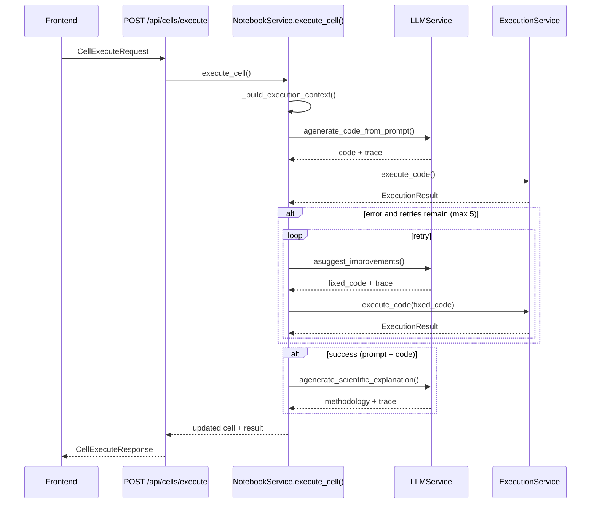
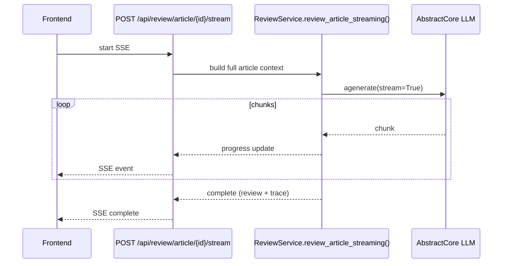
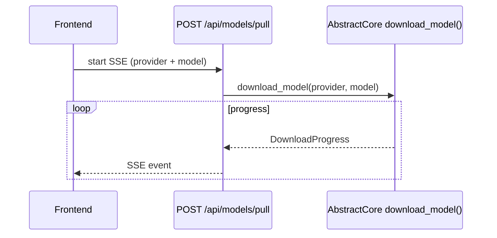
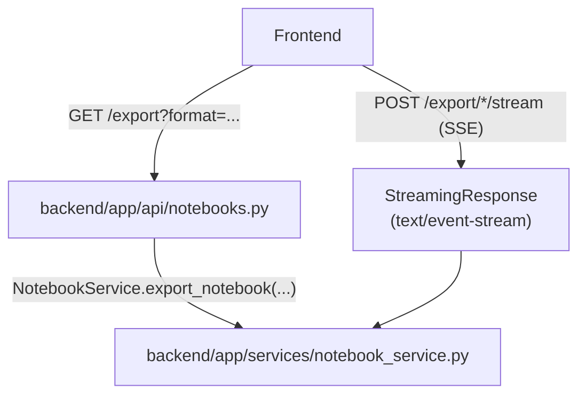

# Data Flow (call graphs and key sequences)

This document captures the **actual runtime call flows** of Digital Article, grounded in the current codebase.

For the high-level map, see [`docs/architecture.md`](architecture.md).

## Flow 1: Execute a prompt cell (prompt → code → exec → retry → methodology)

Source code:

- API: [`backend/app/api/cells.py`](../backend/app/api/cells.py) (`POST /api/cells/execute`)
- Orchestrator: [`backend/app/services/notebook_service.py::NotebookService.execute_cell()`](../backend/app/services/notebook_service.py)
- LLM integration: [`backend/app/services/llm_service.py`](../backend/app/services/llm_service.py)
- Execution: [`backend/app/services/execution_service.py`](../backend/app/services/execution_service.py)

## Flow 2: Article review (SSE streaming)

Source code:

- API: [`backend/app/api/review.py`](../backend/app/api/review.py) (`POST /api/review/article/{id}/stream`)
- Service: [`backend/app/services/review_service.py::ReviewService.review_article_streaming()`](../backend/app/services/review_service.py)

## Flow 3: Model download (SSE streaming)

Source code:

- API: [`backend/app/api/models.py`](../backend/app/api/models.py) (`POST /api/models/pull`)
- UI: [`frontend/src/contexts/ModelDownloadContext.tsx`](../frontend/src/contexts/ModelDownloadContext.tsx)

## Flow 4: Export (non-streaming vs streaming)

Source code:

- Non-streaming export: `GET /api/notebooks/{id}/export` ([`backend/app/api/notebooks.py`](../backend/app/api/notebooks.py))
- Streaming export:
  - `POST /api/notebooks/{id}/export/semantic/stream`
  - `POST /api/notebooks/{id}/export/pdf/stream`

