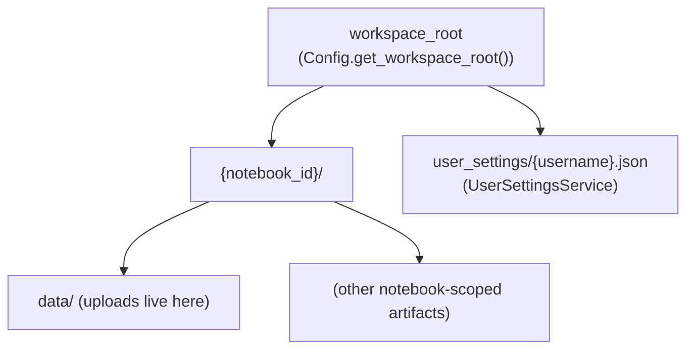

# Dive-in: `DataManagerClean` (workspace files + LLM file context)

## Summary

`DataManagerClean` manages **notebook-scoped files** (uploads, deletes, previews) and produces a compact-but-rich “file context” payload that can be injected into LLM prompts.

Source: [`backend/app/services/data_manager_clean.py`](../../backend/app/services/data_manager_clean.py)

## How it fits in the bigger picture

- The **Files panel** in the frontend calls the backend file APIs:
  - Source: [`backend/app/api/files.py`](../../backend/app/api/files.py) (mounted under `/api/files/*` in [`backend/app/main.py`](../../backend/app/main.py))
- The backend uses `DataManagerClean.get_execution_context()` to add file previews and metadata into the LLM context:
  - Source: [`backend/app/services/notebook_service.py::NotebookService._build_execution_context()`](../../backend/app/services/notebook_service.py)
  - Review also reuses this for article context: [`backend/app/services/review_service.py::_build_full_article_context()`](../../backend/app/services/review_service.py)

## Workspace layout

The `workspace_root` comes from:

- [`backend/app/config.py::Config.get_workspace_root()`](../../backend/app/config.py) (ENV `WORKSPACE_DIR` > [`config.json`](../../config.json) > default)

## What “file context” includes

`list_available_files()` and `get_execution_context()` implement a **general-purpose preview strategy**:

- Tabular data (CSV/TSV/Parquet/Excel): sample rows + inferred column semantics + basic stats
- Text/JSON/YAML/Markdown: full content for small files (or truncated previews when large)
- H5/HDF5: metadata view via [`backend/app/services/h5_service.py`](../../backend/app/services/h5_service.py)

This is intentionally designed to give the LLM “enough to act” while remaining robust across diverse data types.

## Related endpoints

- List files: `GET /api/files/{notebook_id}` → [`backend/app/api/files.py::list_notebook_files()`](../../backend/app/api/files.py)
- Read file content: `GET /api/files/{notebook_id}/content?file_path=...`
- Upload: `POST /api/files/{notebook_id}/upload` (multipart)
- Delete: `DELETE /api/files/{notebook_id}/{file_name}`

## Known limitations / follow-ups

- File previews can become token-heavy for large datasets; the system relies on sampling/truncation to remain within model context limits.

## Related dive-ins

- [`docs/dive_ins/notebook_service.md`](notebook_service.md)
- [`docs/dive_ins/llm_service.md`](llm_service.md)

