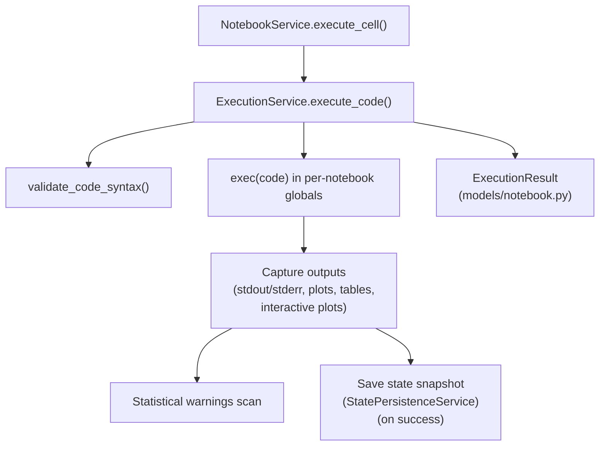

# Dive-in: `ExecutionService` (Python execution + rich outputs)

## Summary

`ExecutionService` is responsible for **executing Python code** for a notebook cell and capturing outputs in a UI-friendly structure:

- `stdout` / `stderr`
- Matplotlib figures (base64 PNG)
- Plotly figures (JSON)
- Tables (DataFrames rendered/serialized)
- Non-fatal statistical warnings
- Errors (type, message, traceback)

Source: [`backend/app/services/execution_service.py::ExecutionService`](../../backend/app/services/execution_service.py)

## How it fits in the bigger picture

`NotebookService.execute_cell()` delegates actual execution to:

- `ExecutionService.execute_code(code, cell_id, notebook_id)`

The results are stored in:

- [`backend/app/models/notebook.py::ExecutionResult`](../../backend/app/models/notebook.py)
- attached to the cell as `cell.last_result`

## Execution pipeline (high-level)

## Isolation model: per-notebook globals

Execution uses an in-memory namespace per notebook:

- Key structure: `ExecutionService.notebook_globals` (dictionary keyed by notebook ID)
- Initialization: `_initialize_globals()` sets up common imports and helpers
- Retrieval: `_get_notebook_globals()` returns the notebook-specific dict (and integrates state restore)

This is what provides the “Jupyter-like” behavior where variables persist across cells.

## State persistence integration

Execution state can be saved/restored across backend restarts:

- Service: [`backend/app/services/state_persistence_service.py::StatePersistenceService`](../../backend/app/services/state_persistence_service.py)
- Wiring: [`backend/app/services/execution_service.py`](../../backend/app/services/execution_service.py) initializes `StatePersistenceService()` and uses it in `_get_notebook_globals()` and after successful execution.

**Important reality**: `StatePersistenceService` currently defaults to [`backend/notebook_workspace/`](../../backend/notebook_workspace/) for snapshot storage (see its constructor). This is independent of [`config.json`](../../config.json) (`paths.workspace_dir`) used by `DataManagerClean`.

## Rich output capture

Output capture is implemented as specialized helpers in `ExecutionService`, including:

- `_capture_tables()` — DataFrame detection + serialization
- `_capture_plots()` — Matplotlib figure capture
- `_capture_interactive_plots()` — Plotly figure capture (with duplication protections)

Results are returned as `ExecutionResult` and rendered by the frontend’s result panels.

## Validation and safety notes

The current implementation runs user/LLM code in-process. This is suitable for a research prototype but not production-safe without sandboxing (process/container isolation, resource limits, filesystem policy, etc.).

## Related dive-ins

- [`docs/dive_ins/notebook_service.md`](notebook_service.md)
- [`docs/dive_ins/data_manager.md`](data_manager.md) (file context)
- [`docs/variable-state-persistence.md`](../variable-state-persistence.md)

