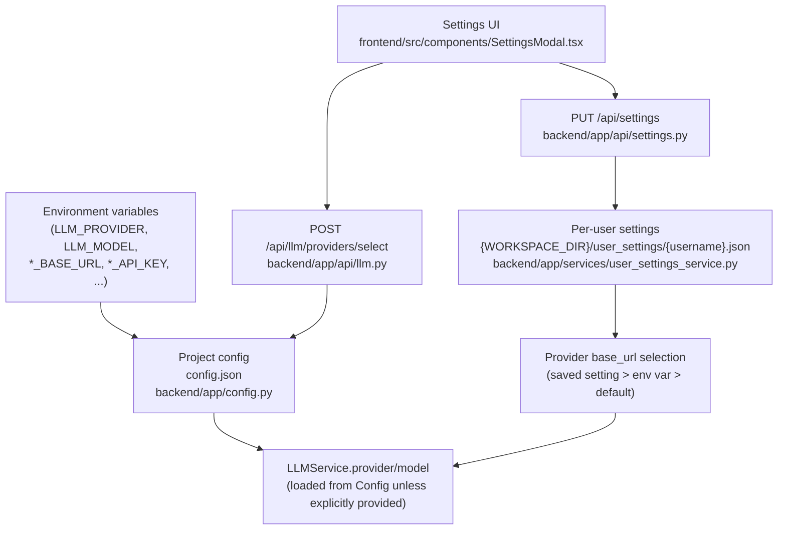

# Dive-in: `LLMService` (AbstractCore integration)

## Summary

`LLMService` is the backend adapter between Digital Article and **LLM providers** (LMStudio, Ollama, OpenAI, Anthropic, OpenAI-compatible servers, etc.). It is responsible for:

- Creating an AbstractCore LLM client (`create_llm(...)`)
- Building system/user prompts (including persona guidance and execution context)
- Async code generation and error-fix suggestions
- Trace capture and token usage tracking

Source: [`backend/app/services/llm_service.py::LLMService`](../../backend/app/services/llm_service.py)

## How it fits in the bigger picture

Multiple backend features depend on `LLMService`:

- **Prompt→code generation**: `NotebookService.execute_cell()` → `LLMService.agenerate_code_from_prompt()`
- **Auto-retry code fixing**: `NotebookService.execute_cell()` → `LLMService.asuggest_improvements()` (ErrorAnalyzer-enhanced)
- **Methodology generation**: `NotebookService.execute_cell()` → `LLMService.agenerate_scientific_explanation()`
- **Review and chat**: Review/Chat also use AbstractCore generation patterns (see [`backend/app/services/review_service.py`](../../backend/app/services/review_service.py), [`backend/app/services/chat_service.py`](../../backend/app/services/chat_service.py))

## Configuration surfaces (what influences which value)

There are multiple configuration layers in the current codebase:

**Key nuance (important for docs and users):**

- `LLMService.__init__()` loads **provider/model** from [`backend/app/config.py`](../../backend/app/config.py) (ENV > [`config.json`](../../config.json) > defaults).
- `_initialize_llm()` loads **base URLs** from **per-user settings** (and falls back to env vars).

## Initialization path (`_initialize_llm`)

Source: [`backend/app/services/llm_service.py::LLMService._initialize_llm()`](../../backend/app/services/llm_service.py)

What it does:

1. Builds AbstractCore creation kwargs (`enable_tracing=True`, `max_traces=100`)
2. Loads per-user base URLs via `get_user_settings_service().get_settings()`
3. Chooses provider-specific `base_url`:
   - `ollama` → `OLLAMA_BASE_URL`
   - `lmstudio` → `LMSTUDIO_BASE_URL`
   - `vllm` → `VLLM_BASE_URL`
   - `openai-compatible` → `OPENAI_COMPATIBLE_BASE_URL`
4. Calls `abstractcore.config.configure_provider(provider, base_url=...)` when applicable
5. Creates the LLM client: `create_llm(self.provider, model=self.model, **kwargs)`
6. On failure, keeps the service alive but sets `self.llm = None` (degraded mode)

## Tracing + token tracking

- Tracing is enabled via AbstractCore’s `enable_tracing=True`.
- `LLMService.agenerate_code_from_prompt()` returns `trace_id` and a `full_trace` dict when available, and upstream (`NotebookService`) persists it into `cell.llm_traces`.
- Token usage is tracked via [`backend/app/services/token_tracker.py::TokenTracker`](../../backend/app/services/token_tracker.py) and relies on provider-reported usage (no estimation).

## How personas influence prompts

Personas are combined inside `NotebookService._build_execution_context()` and passed via the `context` object to `LLMService`.

- Persona models: [`backend/app/models/persona.py`](../../backend/app/models/persona.py)
- Combination logic: [`backend/app/services/persona_service.py::PersonaService.combine_personas()`](../../backend/app/services/persona_service.py)

`LLMService._build_system_prompt(context)` incorporates persona guidance when `context['persona_combination']` is present.

## Related endpoints

- Provider discovery: `GET /api/llm/providers` and `GET /api/llm/providers/{provider}/models` ([`backend/app/api/llm.py`](../../backend/app/api/llm.py))
- Apply provider selection: `POST /api/llm/providers/select` (updates [`config.json`](../../config.json) and reinitializes LLM)
- Status/health: `GET /api/llm/status`
- Ollama connectivity debug: `GET /api/llm/debug/connection`

## Known limitations / follow-ups

- Provider/model vs base_url come from different stores (project config vs per-user settings). The UI currently saves to both, but this is easy to drift in headless use.
- The backend is effectively **single-process**; reinitializing the LLM client affects all in-flight work.

## Related dive-ins

- [`docs/dive_ins/notebook_service.md`](notebook_service.md)
- [`docs/dive_ins/persona_system.md`](persona_system.md)

