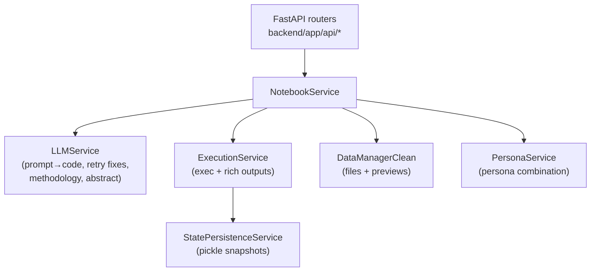
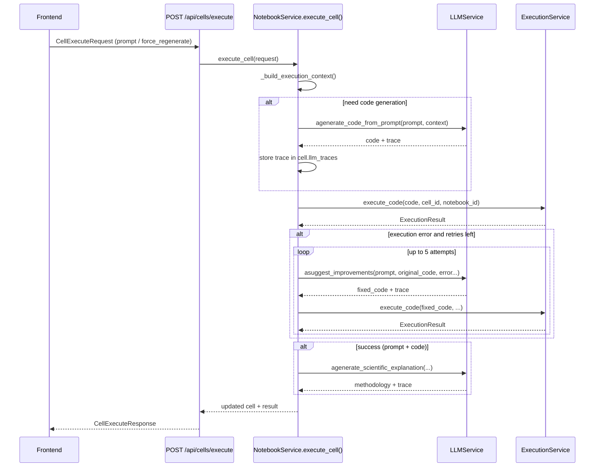

# Dive-in: `NotebookService` (backend orchestration)

## Summary

`NotebookService` is the **central orchestrator** of the backend. It owns the “digital article” lifecycle: notebook CRUD, cell CRUD, prompt→code generation, execution, auto-retry, and methodology generation.

- Source: [`backend/app/services/notebook_service.py::NotebookService`](../../backend/app/services/notebook_service.py)

## How it fits in the bigger picture

At runtime, nearly every user action funnels into one of the FastAPI routers, which then delegates to `NotebookService` for “business logic”:

- **Create/load/save notebooks**: `/api/notebooks/*` → `NotebookService`
- **Execute a cell**: `POST /api/cells/execute` → `NotebookService.execute_cell()` → `LLMService` + `ExecutionService`
- **Export / review orchestration**: `NotebookService` coordinates other services (PDF, semantic, review) as needed

## Dependency graph (service-level)

## The core execution loop (`execute_cell`)

### What it does

`NotebookService.execute_cell()` performs these steps (simplified):

1. Resolve the target cell + notebook from the in-memory cache
2. Build LLM context (files, variables, previous cells, persona combination)
3. If code is missing or forced: generate code via `LLMService.agenerate_code_from_prompt()`
4. Execute code via `ExecutionService.execute_code()`
5. If execution fails: **auto-retry** up to 5 times using `LLMService.asuggest_improvements()` (ErrorAnalyzer-enhanced)
6. On success: generate scientific methodology text via `LLMService.agenerate_scientific_explanation()`
7. Persist notebook JSON to disk using an atomic write strategy

### Sequence diagram (prompt cell execution)

## Code references (key methods)

- **Context building**: [`backend/app/services/notebook_service.py::NotebookService._build_execution_context()`](../../backend/app/services/notebook_service.py)
  - Includes: persona combination, file previews, available variables, previous cells, notebook/cell IDs (token tracking)
- **Code generation**: `NotebookService.execute_cell()` → `LLMService.agenerate_code_from_prompt()`
  - Per-notebook LLM selection: if `notebook.llm_provider/model` differs, the service reinitializes `LLMService`
- **Auto-retry (up to 5 attempts)**:
  - Uses `LLMService.asuggest_improvements()` (which enhances context using `ErrorAnalyzer`)
  - Critical design choice: retries always pass the **original generated code**, not mutated retries
- **Methodology generation**:
  - Calls `LLMService.agenerate_scientific_explanation()` after successful execution (up to 3 methodology attempts)
- **Persistence**:
  - Uses `_save_notebook()` with an atomic write pattern to avoid corruption

## What gets persisted

- **Notebook JSON**: stored under `Config.get_notebooks_dir()` (ENV `NOTEBOOKS_DIR` > [`config.json`](../../config.json) > default)
- **Cell traces**: `cell.llm_traces` and `cell.metadata['trace_ids']` are persisted in the notebook JSON
- **Review artifacts**:
  - Cell reviews stored in `cell.metadata['review']` ([`backend/app/api/review.py`](../../backend/app/api/review.py))
  - Article review stored in `notebook.metadata['article_review']`

## Known limitations (current design reality)

- **In-process execution**: code runs in the backend process via `exec()` (see `ExecutionService`). This is not production-safe without sandboxing.
- **Single-process service state**: `NotebookService` holds an in-memory notebook cache and a mutable `self.llm_service`; concurrent multi-user execution is not isolated.

## Related dive-ins

- [`docs/dive_ins/llm_service.md`](llm_service.md)
- [`docs/dive_ins/execution_service.md`](execution_service.md)
- [`docs/dive_ins/data_manager.md`](data_manager.md)

