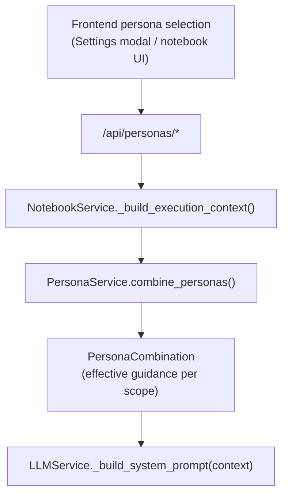

# Dive-in: Persona system (`PersonaService` + persona models)

## Summary

Personas are structured “behavior + domain” configurations that shape how the LLM generates code/methodology/chat/review. The persona system supports:

- System personas (checked into the repo)
- Custom personas (per-user JSON files)
- Combination/merging of multiple personas into effective guidance

Core code:

- Models: [`backend/app/models/persona.py`](../../backend/app/models/persona.py)
- Service: [`backend/app/services/persona_service.py`](../../backend/app/services/persona_service.py)
- API: [`backend/app/api/personas.py`](../../backend/app/api/personas.py) (mounted at `/api/personas/*`)

## How it fits in the bigger picture

Personas influence LLM behavior via the execution context built in `NotebookService`:

- [`backend/app/services/notebook_service.py::NotebookService._build_execution_context()`](../../backend/app/services/notebook_service.py)
  - loads `notebook.metadata['personas']`
  - combines personas using `PersonaService.combine_personas(...)`
  - injects the combination into the LLM context

## Persona storage layout

- **System personas**: [`data/personas/system/*.json`](../../data/personas/system/)
- **Custom personas**: [`data/personas/custom/{username}/*.json`](../../data/personas/custom/)

This is initialized by `PersonaService.__init__()` which defaults the workspace to the project’s [`data/`](../../data) folder.

## Combination rules (merging)

Combination logic lives in `PersonaService.combine_personas()`:

- Personas are sorted by `priority` where **lower numbers are higher priority** and are applied last (win conflicts).
- Guidance is merged per `PersonaScope`:
  - `system_prompt_addition` is concatenated
  - `constraints` are unioned
  - `preferences` are merged with “last writer wins”
  - examples are limited

## Notebook persona selection

Notebook persona selection is stored in:

- `notebook.metadata['personas']` as a `PersonaSelection` ([`backend/app/models/persona.py`](../../backend/app/models/persona.py))

Endpoints:

- `GET /api/personas/notebooks/{notebook_id}/personas`
- `PUT /api/personas/notebooks/{notebook_id}/personas`

Current default behavior: if a notebook has no personas set, the API returns a default base persona of `clinical` (see [`backend/app/api/personas.py`](../../backend/app/api/personas.py)).

## Reviewer persona is “internal”

The review system loads a persona with slug `reviewer` from:

- [`data/personas/system/reviewer.json`](../../data/personas/system/reviewer.json)

That persona is currently marked `is_active: false` (so it is hidden from normal persona listing by default), but `ReviewService` loads it directly by slug.

## Related dive-ins

- [`docs/dive_ins/llm_service.md`](llm_service.md)
- [`docs/dive_ins/review_service.md`](review_service.md)

