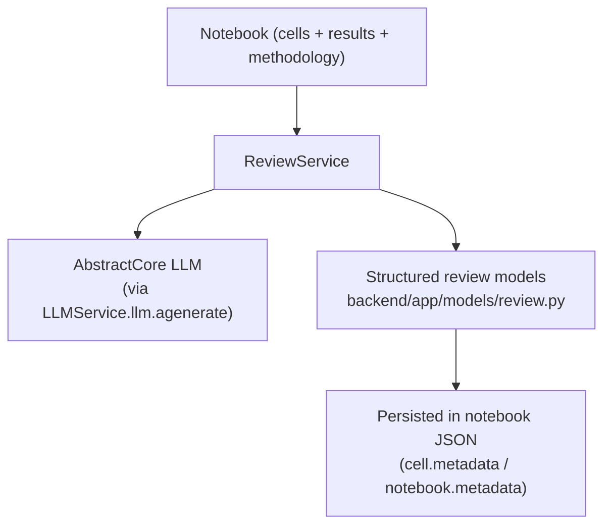

# Dive-in: Review system (`ReviewService` + reviewer persona)

## Summary

Digital Article includes an optional **peer-review-style critique** system for:

- **Cell-level review** (implementation + results)
- **Article-level synthesis review** (structured journal-style report + dimensional ratings)

Core implementation:

- Service: [`backend/app/services/review_service.py::ReviewService`](../../backend/app/services/review_service.py)
- API: [`backend/app/api/review.py`](../../backend/app/api/review.py) (mounted under `/api/review/*` in [`backend/app/main.py`](../../backend/app/main.py))

## How it fits in the bigger picture

The review system is a parallel “quality layer” on top of the notebook execution pipeline:

## Reviewer persona: templates + internal use

The review system uses the **system persona** `reviewer`:

- Persona file: [`data/personas/system/reviewer.json`](../../data/personas/system/reviewer.json)
- Loaded via: [`backend/app/services/persona_service.py::PersonaService.get_persona('reviewer')`](../../backend/app/services/persona_service.py)

Important nuance:

- The `reviewer` persona is active/visible in normal persona listing.
- `ReviewService` also loads it directly by slug (it does not filter by `is_active`).

## Review modes

### Cell review

- Endpoint: `POST /api/review/cell?notebook_id=...&cell_id=...`
- Implementation: `ReviewService.review_cell()`
- What it does:
  - If cached review exists in `cell.metadata['review']` and `force=false`, reuse it
  - Otherwise run:
    - **Implementation review** (uses reviewer persona “implementation” template)
    - **Results review** (uses reviewer persona “results” template)
  - Persist back into the notebook JSON via `NotebookService._save_notebook()`

### Article review (full synthesis)

- Endpoint: `POST /api/review/article/{notebook_id}` (non-streaming)
- Endpoint: `POST /api/review/article/{notebook_id}/stream` (**SSE streaming**)
- Implementation: `ReviewService.review_article()` and `ReviewService.review_article_streaming()`
- Key design points:
  - Builds a **complete article context** including file previews and full cell details (`_build_full_article_context()`)
  - Uses:
    - a reviewer persona **synthesis template** (`reviewer.review_capabilities[phase=synthesis]`)
    - plus an explicit “SOTA” review system prompt (`ReviewService.REVIEW_SYSTEM_PROMPT`)
  - Captures and persists the **latest** review trace in `notebook.metadata['review_traces']`

## Review settings

Notebook-scoped review settings are stored in notebook metadata:

- Get: `GET /api/review/notebooks/{notebook_id}/settings`
- Set: `PUT /api/review/notebooks/{notebook_id}/settings`
- Storage: `notebook.metadata['review_settings']`

## Related dive-ins

- [`docs/dive_ins/persona_system.md`](persona_system.md)
- [`docs/dive_ins/llm_service.md`](llm_service.md)
- [`docs/dive_ins/notebook_service.md`](notebook_service.md)

